> 내가 키우는 뽀모도로 방울이

 

# 🍅 방울이 : 내가 키우는 뽀모도로
방울이는 기존에 있던 Pomodoro 타이머 기법을 더 즐겁게 활용하여 자신의 집중시간을 관리하는 서비스입니다.
#### 📃 [랜딩 페이지](http://52.78.240.117:8081/)
#### 🎥 [시연영상](md_resources/demo_video.mp4)
#### 🖥️ [발표자료](md_resources/bangwool_demo_day_ppt.pdf)

 

# 🏷️ 목차
### 1. 프로젝트 소개
###### &nbsp;&nbsp;1.1 overview
###### &nbsp;&nbsp;1.2 문제인식
###### &nbsp;&nbsp;1.3 해결방안
###### &nbsp;&nbsp;1.4 유저스토리
###### &nbsp;&nbsp;1.5 대상유저
### 2. 기능
###### &nbsp;&nbsp;2.1 로그인을 통해 개인 설정 저장(일반, 소셜)
###### &nbsp;&nbsp;2.2 타이머 추가, 편집, 삭제
###### &nbsp;&nbsp;2.3 오늘의 집중 시간
###### &nbsp;&nbsp;2.4 주간, 월간의 집중 시간 통계
###### &nbsp;&nbsp;2.5 일간, 주간 집중 시간 랭킹
###### &nbsp;&nbsp;2.6 계정 설정
### 3. 기대효과
###### &nbsp;&nbsp;3.1 즐거운 집중 시간
###### &nbsp;&nbsp;3.2 시간관리기법 공유
### 4. 설치안내
###### &nbsp;&nbsp;4.1 스토어 출시 이전(현재)
###### &nbsp;&nbsp;4.2 스토어 출시 이후(예정)
### 5. 개발
###### &nbsp;&nbsp;5.1 기술스택
###### &nbsp;&nbsp;5.2 기획, IA, 플로우차트
###### &nbsp;&nbsp;5.3 시스템 아키텍쳐
###### &nbsp;&nbsp;5.4 협업 툴 활용
### 6. 팀정보

 

# 🍅 1. 프로젝트 소개
## &nbsp;&nbsp;🎯 1.1 overview

방울이는 기존에 존재하던 뽀모도로 시간관리 기법을 더 즐겁게 활용할 수 있도록 도와주는 서비스입니다.

방울이는 기존의 뽀모도로 기법을 응용한 방울 뽀모도로 기법을 중심으로 사용자에게 긍정적인 감정 경험을 제공합니다.

서비스 이용자는 여러 종류의 타이머를 추가하고 실행하여 자신의 집중시간을 관리할 수 있습니다.

또한 자신의 집중 시간에 대한 통계, 랭킹을 확인할 수 있습니다.

귀여운 캐릭터와 쉬운 난이도, 기록 공유를 통한 동기부여로 

더 즐겁게 뽀모도로 시간관리법을 적용하면서 성장해나가는 자신을 발견할 수 있습니다.

주변을 둘러보면 시간관리에 관심이 있지만 시작하거나 지속하는데 어려움을 겪는 사람들을 쉽게 찾아볼 수 있습니다.

방울이는 그런 사람들에게 도움이 되고 더 나아가 시간관리 문화를 전파하고자 합니다.

## &nbsp;&nbsp;🤔 1.2 문제인식

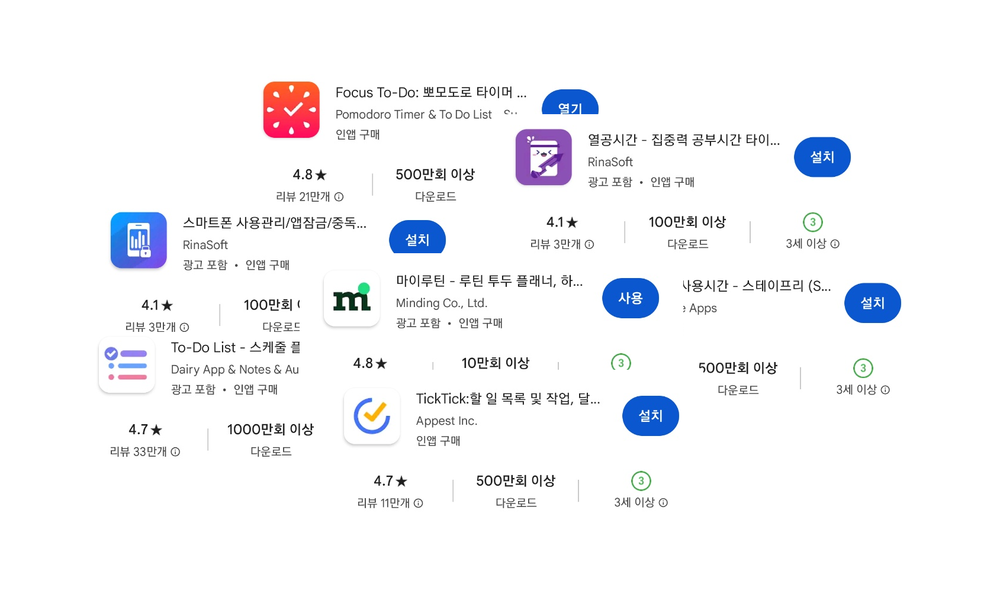
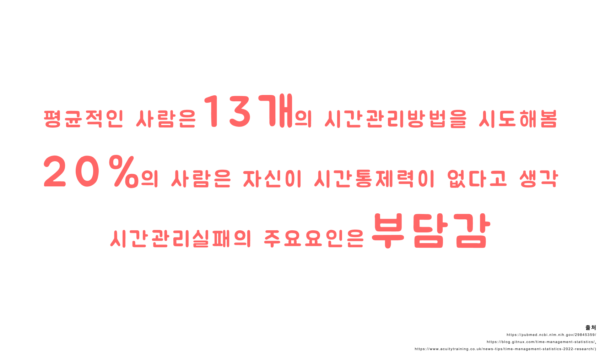

시간관리기법을 위한 서비스는 이미 많이 찾아볼 수 있습니다.

어플리케이션의 형태로 된 것들도 이미 다수 존재합니다.

또한 이미 시간관리에 대한 수요도 그만큼 많이 존재하고 있습니다.

경험적으로 많이 느끼셨겠지만 그러한 수요와 서비스의 규모에도 불구하고

성공적으로 시간관리를 할 수 있게된 사람은 그렇게 많지 않습니다.

많은 이유가 있겠지만 가장 많은 이유로는 실패에 대한 두려움 

즉 부담감과 동기부여, 흥미제공 요인이 부족한 것을 꼽을 수 있겠습니다.

한 마디로 말해 사용자에게 제공되는 긍정적인 감정적 경험이 부족하다는 것입니다.

그래서 방울이는 시간을 관리하는 것이 힘들고 지루한 일이 아니라 

얼마든지 쉽고 재미있게 할 수 있다는 알려주는 서비스가 되고자 했습니다.

## &nbsp;&nbsp;✅ 1.3 해결방안

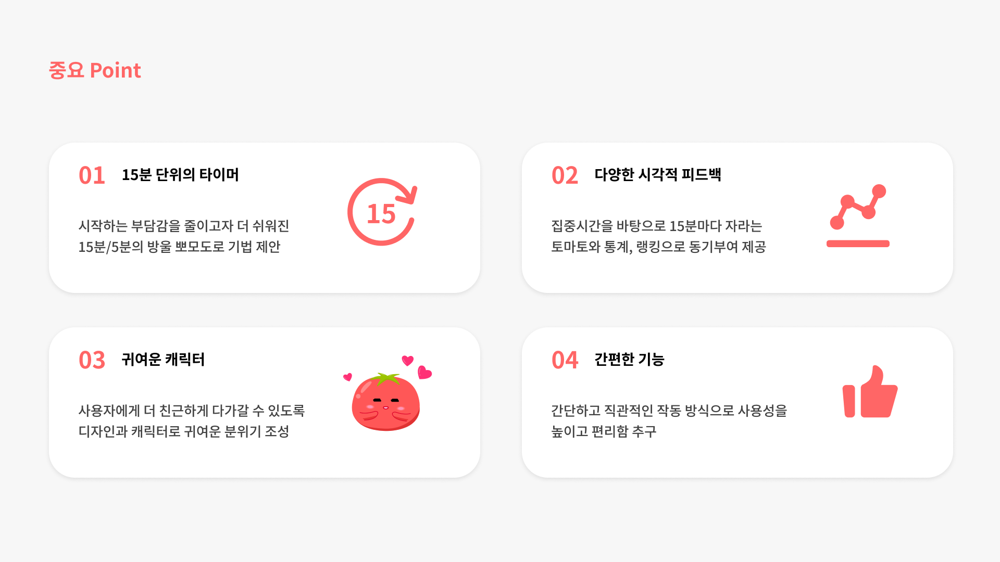

방울이는 시간관리를 하면서 경험하는 부정적인 감정들을 줄이고 긍정적인 감정을 늘리는데 초점이 맞춰진 솔루션입니다.

첫째로, 사람을 기분좋게 만들어 부담감을 덜어주는 긍정적인 무드를 형성할 수 있는 귀여운 캐릭터와 디자인을 제공합니다.

둘째로는 부담감을 줄이기 위한 방울 뽀모도로 기법을 제안합니다.

방울 뽀모도로 기법이란 일반적인 뽀모도로 기법이 25분의 집중시간, 

5분의 휴식시간을 갖는 것과 달리 15분의 집중시간과 5분의 휴식시간을 가지는 기법을 의미합니다.

서비스 이용자는 자신의 타이머 시간을 커스텀할 수 있지만 

기본적으로 제공되는 타이머의 시간은 집중시간 15분과 휴식시간 5분으로 설정되어있고,

일일 통계인 오늘의 뽀모 또한 15분이 지날 때마다 나무에 토마토가 1개씩 추가됩니다.

쉬움을 추구하는 방울 뽀모도로 기법은 사용자의 부담을 줄여주고 성취감을 제공하여 

긍정적인 감정을 극대화하고 부정적인 감정을 최소화할 수 있습니다.

셋째로, 일일 통계인 오늘의 뽀모, 주간/월간 통계 그리고 일간/주간 랭킹을 제공하여 

사용자에게 동기부여와 승부욕이라는 긍정적인 감정을 제공합니다.

마지막으로는 핵심기능만을 간단하고 직관적인 방식으로 제공하여 사용자가 처음 서비스를 이용하면서 

부담감을 느끼게 되는 진입장벽을 최소화하여 역시 감정적인 지원을 제공합니다.

 

# 🛠️ 2. 기능

## &nbsp;&nbsp;🚪 2.1 로그인을 통해 개인 설정 저장(일반, 소셜)

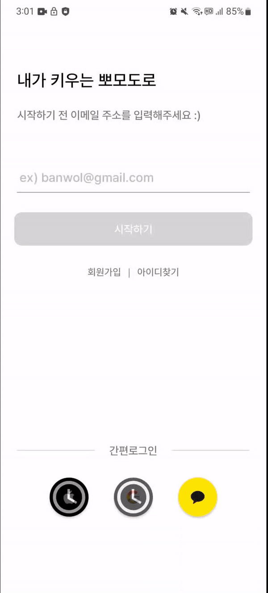

- 자체적인 회원가입 로그인을 지원합니다.
- 카카오톡을 통한 소셜로그인도 지원합니다.
- 추후 구글, 애플 로그인도 지원할 예정.

## &nbsp;&nbsp;⏰ 2.2 타이머 추가, 편집, 삭제

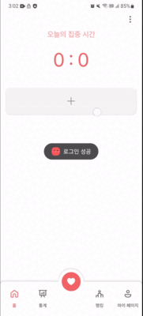

- 타이머의 이름, 색상, 시간을 설정하고 추가할 수 있습니다.
- 타이머를 수정하고 삭제할 수 있습니다.
- 애니메이션이 적용된 귀여운 방울이와 함께 타이머를 진행할 수 있습니다.

## &nbsp;&nbsp;🍅 2.3 오늘의 집중 시간

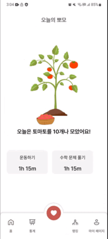

- 오늘의 토마토 수확량을 확인하며 성취감과 동기부여를 얻을 수 있습니다.
- 공유 기능이 추가될 예정입니다.

## &nbsp;&nbsp;📊 2.4 주간, 월간의 집중 시간 통계

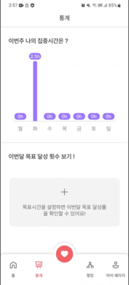

- 주간, 월간 자신의 집중시간을 정리해서 확인하며 성취감을 얻을 수 있습니다.
- 설정한 목표시간에 따라 다르게 보입니다.

## &nbsp;&nbsp;🏅 2.5 일간, 주간 집중 시간 랭킹

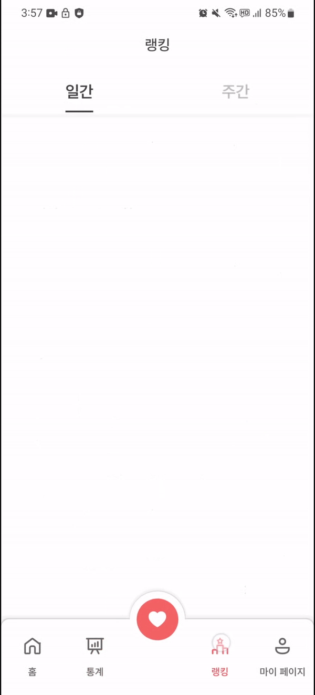

- 주간, 월간 집중시간 랭킹을 확인하며 승부욕과 성취감을 느낄 수 있습니다.
- 자신의 랭킹을 중심으로 확인이 가능합니다.

## &nbsp;&nbsp;⚙️ 2.6 계정 설정

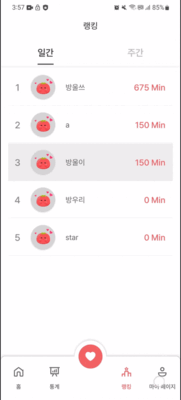

- 자신의 개인정보를 변경하거나(예정) 공지사항(예정), 앱정보 등을 확인할 수 있습니다.
- 로그아웃이나 회원탈퇴(예정)가 가능합니다.

 

# 🏆 3. 기대효과
## &nbsp;&nbsp;😋 3.1 즐거운 집중 시간

방울이는 방울 뽀모도로 기법, 오늘의 뽀모도로, 통계, 랭킹 등의 기능을 통해 

시간관리를 하며 느낄 수 있던 부정적인 감정을 최소화하고

긍정적인 감정을 최대화 합니다. 사용자는 이를 통해 시간 관리에 대한 부담을 줄이고 원동력을 얻을 수 있습니다.

결과적으로 사용자는 집중시간이 전보다 더 즐겁다고 느끼게 되어 시간관리를 더 잘 할 수 있게 됩니다.

## &nbsp;&nbsp;🏯 3.2 시간관리문화 활성화

방울이는 오늘의 뽀모 공유(개발중)와 랭킹 기능을 통해 자신의 집중시간을 공유할 수 있습니다.

이는 더 지속적인 집중습관개발이 가능하도록 도우며 많은 이들이 시간관리를 추구하도록 만들 수 있습니다.

 

# 💿 4. 설치안내
## &nbsp;&nbsp;📦 4.1 스토어 출시 이전(현재)

2023.08.15 현재 방울이는 스토어 미출시 상태이며, 출시를 준비하고 있습니다.

따라서 현재 방울이 서비스를 이용하기 위해서는 apk를 따로 다운로드 받아 설치하셔야 합니다.

[방울이 demo version 다운로드(준비중)]()

## &nbsp;&nbsp;🛍️ 4.2 스토어 출시 이후(예정)

추후 방울이가 앱스토어에 출시된다면 해당 경로로 이동하여 설치하시면 됩니다.

 

# 💻 5. 개발
## &nbsp;&nbsp;📚 5.1 기술스택

 
   
  
   
   
  
   
  
   

  
   
  
  

## &nbsp;&nbsp;📑 5.2 기획, IA, 플로우차트
### [기획서](md_resources/proposal.docx)

### IA
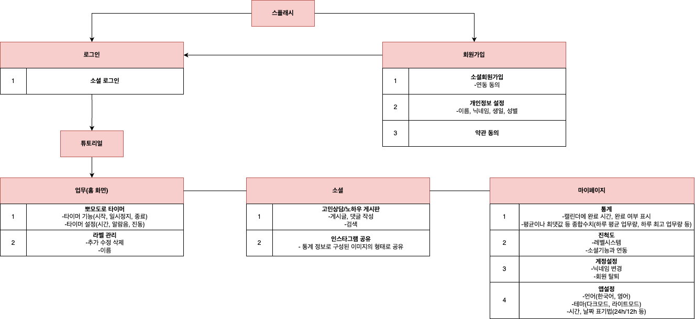

### FlowChart
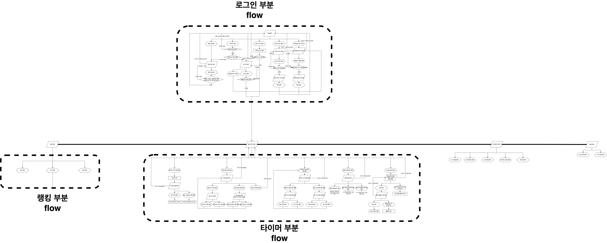

## &nbsp;&nbsp;🔌 5.3 시스템 아키텍쳐

## &nbsp;&nbsp;💬 5.4 협업 툴 활용

### Jira
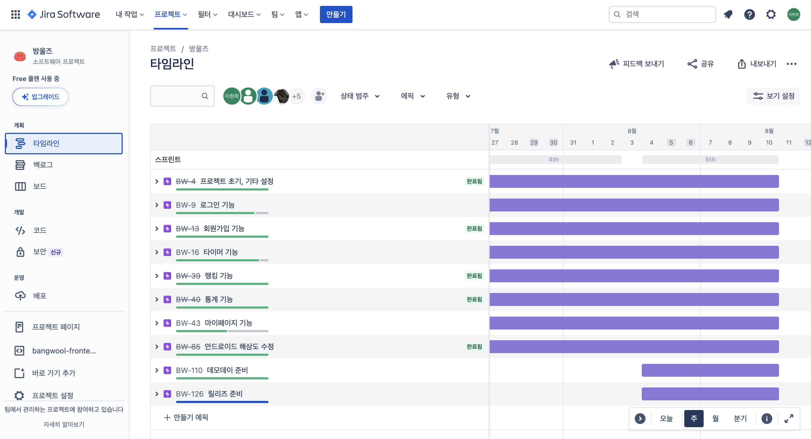

### Slack
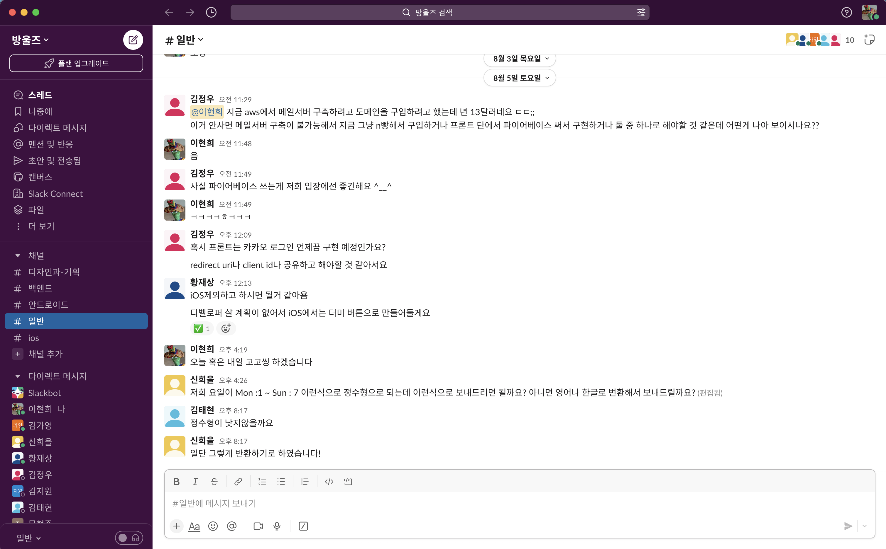

### Github
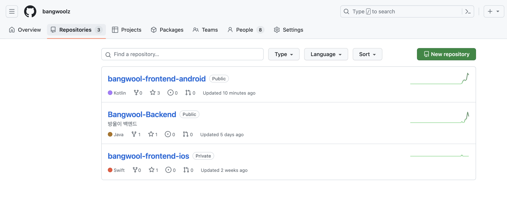

 
  
# 👨‍👩‍👧‍👦 6. 팀정보
<table>
 <tr>
  <td align='center'>사진</td>
  <td align='center'>이름</td>
  <td align='center'>역할</td>
  <td align='center'>GitHub</td>
  <td align='center'>E-Mail</td>
 </tr>
   
 <tr>
  <td align='center'></td>
  <td align='center'>이현희</td>
  <td align='center'>팀장 PM FE-android 팀장 BE 개발</td>
  <td align='center'></td>
  <td align='center'></td>
 </tr>

 <tr>
  <td align='center'></td>
  <td align='center'>김가영</td>
  <td align='center'>디자이너 앱 화면, 로고, 캐릭터 디자인 프로젝트 기획</td>
  <td align='center'></td>
  <td align='center'></td>
 </tr>
 
 <tr>
  <td align='center'></td>
  <td align='center'>김태현</td>
  <td align='center'>FE-android 개발 timer, statistics 화면/기능 제작 프로젝트 기획</td>
  <td align='center'></td>
  <td align='center'></td>
 </tr>

 <tr>
  <td align='center'></td>
  <td align='center'>김지원</td>
  <td align='center'>FE-android 개발 login, timer list, day statistics 화면/기능 제작</td>
  <td align='center'></td>
  <td align='center'></td>
 </tr>

 <tr>
  <td align='center'></td>
  <td align='center'>문현준</td>
  <td align='center'>FE-android 개발 register, ranking, mypage 화면/기능 제작</td>
  <td align='center'></td>
  <td align='center'></td>
 </tr>
   
 <tr>
  <td align='center'></td>
  <td align='center'>황재상</td>
  <td align='center'>FE-ios 팀장 ios 총개발</td>
  <td align='center'></td>
  <td align='center'></td>
 </tr>

  <tr>
  <td align='center'></td>
  <td align='center'>김정우</td>
  <td align='center'>BackEnd 팀장 ERD 구상 서버 배포, CI/CD 구성 ppomodoro, Login 기능 구현</td>
  <td align='center'></td>
  <td align='center'></td>
 </tr>

 <tr>
  <td align='center'></td>
  <td align='center'>신희을</td>
  <td align='center'>BackEnd 개발 ERD 구상 work, member 기능 구현</td>
  <td align='center'></td>
  <td align='center'></td>
 </tr>

  <tr>
  <td align='center'></td>
  <td align='center'>이영선</td>
  <td align='center'>BackEnd 개발 ERD 구상 kakao login, login 기능 구현</td>
  <td align='center'></td>
  <td align='center'></td>
 </tr>
</table>

